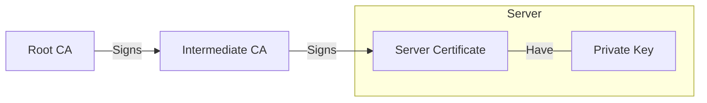

Although not required adding /usr/sbin to the PATH environment variable makes it easier to call some binaries in this guide

Add `/usr/sbin` folder to `$PATH` environment variable

```bash
export PATH=$PATH:/usr/sbin
```

Make this change persistent by editing the `.bashrc` file

```bash
echo "PATH=$PATH:/usr/sbin" >> ~/.bashrc
```

## Table of Contents

1. [Networking](#networking)<br>
   1.1. [Static IP Configuration](#static-ip-configuration)<br>
   1.2. [Basic Firewall Setup](#basic-firewall-setup)<br>
   
2. [SSH Server](#ssh-server-setup)<br>
   2.1. [Public Key Authentication](#public-key-authentication)<br>
   2.2. [Disable Root Login](#disable-root-login)<br>
   2.3. [Login Attempt Duration](#login-attempt-duration)<br>
   2.4. [Limit User Access](#limit-user-access)<br>
   
3. [OpenLDAP](#ldap-server-setup)<br>
   3.1. [Installation](#installation)<br>
   3.2. [Basic Configuration](#basic-configuration)<br>
   3.3. [Disable Anonymous Bind](#disable-anonymous-bind)<br>
   3.4. [Enable LDAPS](#enable-ldaps)<br>
   3.5. [Certificate Chain](#certificate-chain)<br>
   3.6. [Adjust File Permissions](#adjust-file-permissions)<br>
   3.7. [Add Certificates](#add-certificates)<br>
   3.8. [Force Secure Connection](#force-secure-connection)<br>
   3.9. [Add Necessary Firewall Rules](#add-necessary-firewall-rules)<br>
   3.10. [Test Connection](#test-connection)<br>

4. [Samba](#samba)<br>
   4.1. [Installation](#installation-1)<br>
   4.2. [Add Necessary Firewall Rules](#add-necessary-firewall-rules-1)<br>
   4.3. [Basic Configuration](#basic-configuration-1)<br>
   4.4. [LDAP Backend](#ldap-backend)<br>
   4.5. [Populate LDAP](#populate-ldap)<br>
   4.6. [Add Users](#add-users)<br>

## Networking

### Static IP Configuration

Check network interfaces available and its names

```bash
ip addr
```

Backup the configuration file before editing

```bash
cp /etc/network/interfaces /etc/network/interfaces.old
```

Edit the respective network interface entry on `/etc/network/interfaces`

```bash
auto eht0
iface etho inet static
    address 192.168.15.180/24
    gateway 192.168.15.1
```

Restart the service to apply these changes

```bash
systemctl restart networking
```

### Basic Firewall Setup

Backup the original configuration file

```bash
cp /etc/nftables.conf /etc/nftables.conf.old
```

Enable and start nftables daemon

```bash
systemctl enable nftables && systemctl start nftables
```

Add SSH rule to prevent lockout from the server

```bash
nft add rule inet filter input ip saddr 192.168.15.0/24 tcp dport 22 accept
```

Replace the default input chain policy to drop all other packets not specified

```bash
nft chain inet filter input '{ type filter hook input priority filter ; policy drop ; }'
```

Replace the default forward chain policy to drop all other packets since the server is not a router

```bash
nft chain inet filter forward '{ type filter hook forward priority filter ; policy drop ; }'
```

Add neighbor discovery rule for ipv6

```bash
nft add rule inet filter input icmpv6 type { nd-neighbor-solicit, nd-router-advert, nd-neighbor-advert } accept
```

Add rule for established, related and invalid packets

```bash
nft add rule inet filter input ct state vmap { established : accept, related : accept, invalid : drop } 
```

Add rule to communicate with localhost

```bash
nft add rule inet filter input iifname "lo" accept
```

Make these changes persistent

```bash
nft list ruleset > /etc/nftables.conf
```

## SSH Server Setup

In your client machine:

- Generate your key pair using `ssh-keygen`, keep your private key in a safe place;
- Add the private key to the ssh agent using `ssh-add` for passwordless login (Optional);

In your server machine:

- Create the `.ssh` directory on the user's home folder;
- Create the `authorized_keys` file and paste your public key inside

### Public Key Authentication

Backup the configuration file before making any changes

```bash
cp /etc/ssh/sshd_config /etc/ssh/sshd_config.old
```

Uncomment the entries related to public key authentication

```bash
sed -i '/#AuthorizedKeysFile/s/^#//' /etc/ssh/sshd_config
sed -i '/#PermitEmptyPasswords/s/^#//' /etc/ssh/sshd_config
```

Disable password authentication

```bash
sed -i 's/#PasswordAuthentication yes/PasswordAuthentication no/' /etc/ssh/sshd_config
```

### Disable Root Login

Prevent root user from login in directly from ssh

```bash
sed -i '/#PermitRootLogin/s/^#//' /etc/ssh/sshd_config &&
sed -i 's/prohibit-password/no/' /etc/ssh/sshd_config
```

### Login Attempt Duration 

Uncomment the `LoginGraceTime` and change to a reasonable time

```bash
sed -i '/#LoginGraceTime/s/^#//' /etc/ssh/sshd_config
```

### Limit User Access

Limit Access by username. change `<user>` for desired user

```bash
echo -e "\nAllowUsers <user>" >> /etc/ssh/sshd_config
```

Or limit access by groups. change `<group>` for desired group

```bash
echo -e "\nAllowGroups <group>" >> /etc/ssh/sshd_config
```

Finally, restart the service to apply all changes

```bash
systemctl restart sshd
```

## LDAP Server Setup

### Installation

Install the ldap server and utilities

```bash
apt update && apt install -y slapd ldap-utils
```

Enable and start the slapd daemon

```bash
systemctl enable slapd && systemctl start slapd
```

### Basic Configuration

Update domain name, base dn and password. Either with `dpkg-reconfigure slapd` or using the following commands

Create a `.ldif` file containing all desired changes

```bash
cat <<EOF > db.ldif
# Change base dn
dn: olcDatabase={1}mdb,cn=config
changeType: modify
replace: olcSuffix
olcSuffix: dc=example,dc=com
-
# Change the root user name
replace: olcRootDN
olcRootDN: cn=admin,dc=example,dc=com
-
# Change the password for the root user
replace: olcRootPW
olcRootPW: 
EOF
```

Generate the new password hash and redirect it to the previously created `.ldif` file

```bash
slapdpasswd >> db.ldif
```

Make the changes

```bash
ldapmodify -Y EXTERNAL -H ldapi:/// -f ./db.ldif
```

Test the changes

```bash
ldapwhoami -D 'cn=admin,dc=example,dc=com' -W -H ldapi:///
```

The previous command should return

```
dn:cn=admin,dc=example,dc=com
```

Add the base DN

```bash
ldapadd -D 'cn=admin,dc=example,dc=com' -W -H ldapi:/// <<EOF
dn: dc=example,dc=com
objectClass: top
objectClass: dcObject
objectClass: organization
o: example.com
dc: example
EOF
```

Confirm the changes

```bash
ldapsearch -LLL -D cn=admin,dc=example,dc=com -W -H ldapi:/// -b "dc=example,dc=com" "(objectClass=organization)"
```

The previous command should return

```
dn: dc=example,dc=com
objectClass: top
objectClass: dcObject
objectClass: organization
o: example.com
dc: example
```

### Disable Anonymous Bind

Modify the `cn=config` DN to disable Anonymous binds other than authentication

```bash
ldapmodify -Y EXTERNAL -H ldapi:/// <<EOF
dn: cn=config
changeType: modify
add: olcDisallows
olcDisallows: bind_anon
EOF
```

Test anonymous binding

```bash
ldapwhoami -H ldapi:/// -x
```

The previous command should return

```
additional info: anonymous bind disallowed
```

### Enable LDAPS

Enable `slapd` daemon to respond to LDAPS protocol

```bash
sed -i '/SLAPD_SERVICES.*"$/s/"$/ ldaps:\/\/\/"/' /etc/default/slapd
```

Restart the daemon

```bash
systemctl restart slapd
```

### Certificate Chain

You can use both self-signed certificates or well know CAs like Let's Encrypt. In this guide I'll be using self-signed certificates in the following scheme:

<br>



<br>

When exporting the Certificate chain, both CA certificate are combined into a single file `full-chain.pem`, we need the server certificate `server.pem` and it's private key `server.key`.

### Adjust file permissions

After creating the certificate chain adjust file ownership to the openldap daemon user

```bash
chown openldap:openldap server.key server.pem full-chain.pem
```

Move the files to its respective directories

```bash
mv server.pem full-chain.pem /etc/ssl/certs && mv server.key /etc/ssl/private
```

Install acl to a more fine grained permission control

```bash
apt update && apt install -y acl
```

Adjust read and execution permissions on the /etc/ssl/private directory so the openldap user can read the server's private key

```bash
setfacl -m user:openldap:rX /etc/ssl/private
```

### Add Certificates

Specify the certificates in the `cn=config` DN

```bash
ldapmodify -Y EXTERNAL -H ldapi:/// <<EOF
dn: cn=config
changeType: modify
replace: olcTLSCACertificateFile
olcTLSCACertificateFile: /etc/ssl/certs/full-chain.pem
-
replace: olcTLSCertificateKeyFile
olcTLSCertificateKeyFile: /etc/ssl/private/server.key
-
replace: olcTLSCertificateFile
olcTLSCertificateFile: /etc/ssl/certs/server.pem
EOF
```

### Force Secure Connection

Modify the `cn=config` DN to only allow connections using TLS/SSL

```bash
ldapmodify -Q -Y EXTERNAL -H ldapi:/// <<EOF
dn: cn=config
changeType: modify
replace: olcLocalSSF
olcLocalSSF: 128
-
replace: olcSecurity
olcSecurity: ssf=128
EOF
```

### Add necessary firewall rules

Add rule to allow LDAP and LDAPS from the local network

```bash
nft add rule inet filter input ip saddr 192.168.15.0/24 tcp dport { 389, 636 } accept
```

Make changes persistent

```bash
nft list ruleset > /etc/nftables.conf
```

### Test Connection

Test secure connection on port 389

```bash
LDAPTLS_CACERT=/etc/ssl/certs/full-chain.pem ldapwhoami -D cn=admin,dc=example,dc=com -W -H ldap://192.168.15.180 -ZZ
```

Test secure connection on port 636

```bash
LDAPTLS_CACERT=/etc/ssl/certs/full-chain.pem ldapwhoami -D cn=admin,dc=example,dc=com -W -H ldaps://192.168.15.180 -ZZ
```

Both commands should return the admin DN, in this case `cn=admin,dc=example,dc=com`. Keep in mind that the address after the protocol need to match the alternative name within your server certificate. You can change the `TLS_CACERT` constant inside `/etc/ldap/ldap.conf` to make the certificate implicit.

## Samba

This section configures Samba to work only as a file server

### Installation

Install packages
```bash
apt install samba smbldap-tools
```

`smbldap-tools` contains scripts to manage samba users in LDAP

Backup the original configuration file

```bash
cp /etc/samba/smb.conf /etc/samba/smb.conf.old
```

### Add Necessary Firewall Rules

Add firewall rule to allow SMB traffic from local network

```bash
nft add rule inet filter input ip saddr 192.168.15.0/24 tcp dport 445 accept
```

### Basic Configuration

Add basic global configuration

```bash
cat <<EOF > /etc/samba/smb.conf
[global]
   # Protocol version restriction
   client min protocol = SMB3
   # Enforce connection encryption
   smb encrypt = required
   # Enforce Connection Signing
   server signing = mandatory
   # Restrict access to local network and localhost
   hosts allow = 127.0.0.1, 192.168.15.0/24
   # Deny access to every other network scope
   hosts deny = 0.0.0.0/0
   # Specify user level authentication for share access
   security = USER
   # Specify workgroup
   workgroup = WORKGROUP
EOF
```

Reload the configuration

```bash
smbcontrol all reload-config
```

### LDAP Backend

Import Samba `.ldif` schemas into LDAP

```bash
ldapadd -Y EXTERNAL -H ldapi:/// -f /usr/share/doc/samba/examples/LDAP/samba.ldif
```

Add ldap specific configuration

```bash
cat <<EOF >> /etc/samba/smb.conf
   # Set ldap as backend using the LDAP over Unix Domain Socket protocol
   passdb backend = ldapsam:ldapi:///
   # Set the base dn
   ldap suffix = dc=example,dc=com
   # Set the organizational unit where users are stored
   ldap user suffix = ou=users
   # Set the organizational unit where groups are stored
   ldap group suffix = ou=groups
   # Set admin user dn
   ldap admin dn = cn=admin,dc=example,dc=com
   # Discard tls/ssl because we're using the ldapi protocol
   ldap ssl = off
EOF
```

Set the LDAP admin password for Samba

```bash
smbpasswd -W
```

Reload the configuration

```bash
smbcontrol all reload-config
```

### Populate LDAP

Run the configuration script

```bash
smbldap-config
```

You can answer '.' for prompts that support it, at the end you should have a file like the following:

```
SID="S-1-5-21-260430950-3876747439-1527132114"
sambaDomain="WORKGROUP"
slaveLDAP="127.0.0.1"
slavePort="389"
masterLDAP="127.0.0.1"
masterPort="389"
ldapTLS="1"
verify="require"
cafile="/etc/ssl/certs/full-chain.pem"
clientcert=""
clientkey=""
suffix="dc=example,dc=com"
usersdn="ou=users,${suffix}"
computersdn=",${suffix}"
groupsdn="ou=groups,${suffix}"
idmapdn="ou=Idmap,${suffix}"
sambaUnixIdPooldn="sambaDomainName=WORKGROUP,${suffix}"
scope="sub"
password_hash="SSHA"
password_crypt_salt_format=""
userLoginShell="/bin/false"
userHome="/home/%U"
userHomeDirectoryMode="700"
userGecos="System User"
defaultUserGid="513"
defaultComputerGid="513"
skeletonDir="/etc/skel"
shadowAccount="1"
defaultMaxPasswordAge="45"
userSmbHome=""
userProfile=""
userHomeDrive=""
userScript=""
mailDomain=""
with_smbpasswd="0"
smbpasswd="/usr/bin/smbpasswd"
with_slappasswd="0"
slappasswd="/usr/sbin/slappasswd"
```

Create entries required by samba

```bash
smbldap-populate
```

Change user id and group id ranges in case the numbers overlap with the systemns UIDs or GIDs

```bash
ldapmodify -D cn=admin,dc=example,dc=com -W -H ldapi:/// <<EOF
dn: sambaDomainName=WORKGROUP,dc=example,dc=com
changeType: modify
replace: uidNumber
uidNumber: 2000
-
replace: sambaNextRid
sambaNextRid: 2000
-
replace: gidNumber
gidNumber: 4000
EOF
```

### Add Users

Create a user using smbldap-useradd

```bash
smbldap-useradd -P -a <username>
```

Get the uid of the previously created user

```bash
smbldap-usershow <username> | awk -F ': ' '/uidNumber/ {print $2}'
```

Add system user

```bash
useradd -M -s /bin/false -u <uid> <username>
```
