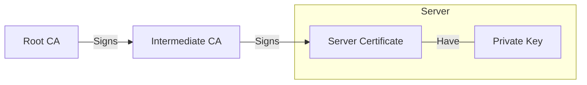

Although not required adding /usr/sbin to the PATH environment variable makes it easier to call some binaries in this guide

```bash
# This folder have some binaries that will not be recognized otherwise
export PATH=$PATH:/usr/sbin

# This change is only for the current session, to make it 
# permanent to the current user edit the .bashrc file
echo "PATH=$PATH:/usr/sbin" >> ~/.bashrc

# Its necessary to add the .bashrc file to the root home folder too
```

## Table of Contents

1. [Networking](#networking)<br>
   1.1. [Static IP Configuration](#static-ip-configuration)<br>
   1.2. [Basic Firewall Setup](#basic-firewall-setup)<br>
   
2. [SSH Server](#ssh-server-setup)<br>
   2.1. [Public Key Authentication](#public-key-authentication)<br>
   2.2. [Disable Root Login](#disable-root-login)<br>
   2.3. [Login Attempt Duration](#login-attempt-duration)<br>
   2.4. [Limit User Access](#limit-user-access)<br>
   
3. [OpenLDAP](#ldap-server-setup)<br>
   3.1. [Installation](#installation)<br>
   3.2. [Basic Configuration](#basic-configuration)<br>
   3.3. [Disable Anonymous Bind](#disable-anonymous-bind)<br>
   3.4. [Enable LDAPS](#enable-ldaps)<br>
   3.5. [Certificate Chain](#certificate-chain)<br>
   3.6. [Adjust File Permissions](#adjust-file-permissions)<br>
   3.7. [Add Certificates](#add-certificates)<br>
   3.8. [Set StartTLS/SSL Only](#set-starttls/ssl-only)<br>
   3.9. [Add Necessary Firewall Rules](#add-necessary-firewall-rules)<br>
   3.10. [Test Connection](#test-connection)<br>

4. [Samba](#samba)<br>
   4.1. [Installation](#installation-1)<br>
   4.2. [Add Necessary Firewall Rules](#add-necessary-firewall-rules-1)<br>
   4.3. [Basic Configuration](#basic-configuration-1)<br>
   4.4. [LDAP Backend](#ldap-backend)<br>
   4.5. [Populate LDAP](#populate-ldap)<br>
   4.6. [Add Users](#add-users)<br>
   4.7. [Add Groups](#add-groups)<br>

## Networking

### Static IP Configuration

```bash
# Check the available interface name, usually eth0
ip addr

# Backup the configuration file before editing
cp /etc/network/interfaces /etc/network/interfaces.old

# Edit the interfaces config file
vim /etc/network/interfaces

# Append or edit the interface entry
auto eht0
iface etho inet static
    address 192.168.15.180/24 # IP address / Subnet mask format
    gateway 192.168.15.1

# Save the file and restart the service
systemctl restart networking
```

### Basic Firewall Setup

```bash
# Backup the original configuration file
cp /etc/nftables.conf /etc/nftables.conf.old

# Enable and start nftables
systemctl enable nftables && systemctl start nftables

# Add SSH rule to prevent lockout to the server
nft add rule inet filter input ip saddr 192.168.15.0/24 tcp dport 22 accept

# Replace the default input chain policy to drop all other packets not specified
nft chain inet filter input '{ type filter hook input priority filter ; policy drop ; }'

# Replace the default forward chain policy to drop all other packets since the server is not a router
nft chain inet filter forward '{ type filter hook forward priority filter ; policy drop ; }'

# Add neighbour discovery rule for ipv6
nft add rule inet filter input icmpv6 type { nd-neighbor-solicit, nd-router-advert, nd-neighbor-advert } accept

# Add rule for established, related and invalid packets
nft add rule inet filter input ct state vmap { established : accept, related : accept, invalid : drop } 

# Add rule to comunicate with localhost
nft add rule inet filter input iifname "lo" accept

# Make the changes persistent
nft list ruleset > /etc/nftables.conf
```

## SSH Server Setup

In your client machine:

- Generate your key pair using `ssh-keygen`, keep your private key in a safe place;
- Add the private key to the ssh agent using `ssh-add` for passwordless login (Optional);

In your server machine:

- Create the `.ssh` directory on the user's home folder;
- Create the `authorized_keys` file and paste your public key inside

### Public Key Authentication

```bash
# Backup the configuration file before making any changes
cp /etc/ssh/sshd_config /etc/ssh/sshd_config.old

# Uncomment the entries related to public key authentication
sed -i '/#AuthorizedKeysFile/s/^#//' /etc/ssh/sshd_config
sed -i '/#PermitEmptyPasswords/s/^#//' /etc/ssh/sshd_config

# Disable password authentication
sed -i 's/#PasswordAuthentication yes/PasswordAuthentication no/' /etc/ssh/sshd_config

# Enable and restart the SSH Server
systemctl enable sshd && systemctl restart sshd
```

### Disable Root Login

```bash
# Prevent root user from login in directly from ssh
sed -i '/#PermitRootLogin/s/^#//' /etc/ssh/sshd_config &&
sed -i 's/prohibit-password/no/' /etc/ssh/sshd_config

# Restart the service to apply changes
systemctl restart sshd
```

### Login Attempt Duration 

```bash
# Uncomment the LoginGraceTime and change to a reasonable time
sed -i '/#LoginGraceTime/s/^#//' /etc/ssh/sshd_config

# Restart the service to apply changes
systemctl restart sshd
```

### Limit User Access

```bash
# Limit Access by username. change <user> for desired user
echo -e "\nAllowUsers <user>" >> /etc/ssh/sshd_config

# Or limit access by groups. change <group> for desired group
echo -e "\nAllowGroups <group>" >> /etc/ssh/sshd_config

# Restart the service to apply changes
systemctl restart sshd
```

## LDAP Server Setup

### Installation

```bash
# Install the ldap server and utilities
apt update && apt install -y slapd ldap-utils

# Enable and start the daemon
systemctl enable slapd && systemctl start slapd
```

### Basic Configuration

Update domain name, base dn and password without dpkg-reconfigure

```bash
# Create a .ldif to set the base dn, new root dn (admin account) and its password
cat <<EOF > db.ldif
# Change base dn
dn: olcDatabase={1}mdb,cn=config
changetype: modify
replace: olcSuffix
olcSuffix: dc=example,dc=com
-
# Change the root user name
replace: olcRootDN
olcRootDN: cn=admin,dc=example,dc=com
-
# Change the password for the root user
replace: olcRootPW
olcRootPW: 
EOF

# Generate the new password hash and redirect it to the previously created .ldif file
slapdpasswd >> db.ldif

# Make the changes
ldapmodify -Y EXTERNAL -H ldapi:/// -f ./db.ldif

# Test the changes
ldapwhoami -D 'cn=admin,dc=example,dc=com' -W -H ldapi:///

# It should return the root base dn
dn:cn=admin,dc=example,dc=com

# Add the base DN
ldapwhoami -D 'cn=admin,dc=example,dc=com' -W -H ldapi:/// <<EOF
dn: dc=example,dc=com
objectClass: top
objectClass: dcObject
objectClass: organization
o: example.com
dc: example
EOF

# Confirm the changes
ldapsearch -D cn=admin,dc=example,dc=com -W -H ldapi:/// -b "dc=example,dc=com" "(objectClass=organization)" -LLL

# it should return
dn: dc=example,dc=com
objectClass: top
objectClass: dcObject
objectClass: organization
o: example.com
dc: example
```

### Disable Anonymous Bind

```bash
# Add entry to config.ldif
ldapmodify -Y EXTERNAL -H ldapi:/// <<EOF
dn: cn=config
changetype: modify
add: olcDisallows
olcDisallows: bind_anon
EOF

# Test anonymous binding
ldapwhoami -H ldapi:/// -x

# it should return
additional info: anonymous bind disallowed
```

### Enable LDAPS

```bash
# Enable LDAPS on port 636
sed -i '/SLAPD_SERVICES.*"$/s/"$/ ldaps:\/\/\/"/' /etc/default/slapd

# Restart the daemon
systemctl restart slapd
```

### Certificate Chain

You can use both self-signed certificates or well know CAs like Let's Encrypt. In this guide I'll be using self-signed certificates in the following scheme:

<br>



<br>

When exporting the Certificate chain, both CA certificate are combined into a single file `full-chain.pem`, we need the server certificate `server.pem` and it's private key `server.key`.

### Adjust file permissions

```bash
# After creating the certificate chain adjust file ownership to openldap daemon user
chown openldap:openldap server.key server.pem full-chain.pem

# Move the files to its respectives directories
mv server.pem full-chain.pem /etc/ssl/certs && mv server.key /etc/ssl/private

# Install acl to a more fine grained permission control
apt update && apt install -y acl

# Adjust read and execution permissions on the /etc/ssl/private directory I'll be using acl
setfacl -m user:openldap:rX /etc/ssl/private
```

### Add Certificates

```bash
ldapmodify -Y EXTERNAL -H ldapi:/// <<EOF
dn: cn=config
changetype: modify
replace: olcTLSCACertificateFile
olcTLSCACertificateFile: /etc/ssl/certs/full-chain.pem
-
replace: olcTLSCertificateKeyFile
olcTLSCertificateKeyFile: /etc/ssl/private/server.key
-
replace: olcTLSCertificateFile
olcTLSCertificateFile: /etc/ssl/certs/server.pem
EOF
```

### Set StartTLS/SSL Only

```bash
# Force only secure connections
ldapmodify -Q -Y EXTERNAL -H ldapi:/// <<EOF
dn: cn=config
changetype: modify
replace: olcLocalSSF
olcLocalSSF: 128
-
replace: olcSecurity
olcSecurity: ssf=128
EOF
```

### Add necessary firewall rules

```bash
# Add rule to allow LDAP and LDAPS
nft add rule inet filter input ip saddr 192.168.15.0/24 tcp dport { 389, 636 } accept

# Make changes persistent
nft list ruleset > /etc/nftables.conf
```

### Test Connection

```bash
# Test secure connection on port 389
LDAPTLS_CACERT=/etc/ssl/certs/full-chain.pem ldapwhoami -D cn=admin,dc=example,dc=com -W -H ldap://192.168.15.180 -ZZ

# Test secure connection on port 636
LDAPTLS_CACERT=/etc/ssl/certs/full-chain.pem ldapwhoami -D cn=admin,dc=example,dc=com -W -H ldaps://192.168.15.180 -ZZ
```

Both commands should return the admin DN, in this case `cn=admin,dc=example,dc=com`. Keep in mind that the address after the protocol need to match the alternative name within your server certificate. You can change the `TLS_CACERT` constant inside `/etc/ldap/ldap.conf` to make the certificate implicit.

## Samba

This section configures Samba to work only as a file server

### Installation

```bash
apt install samba smbldap-tools

# Backup the original configuration file
cp /etc/samba/smb.conf /etc/samba/smb.conf.old
```

### Add Necessary Firewall Rules

```bash
# Open firewall port 445 to local network
nft add rule inet filter input ip saddr 192.168.15.0/24 tcp dport 445 accept
```

### Basic Configuration

```bash
# Add basic global configuration
cat <<EOF > /etc/samba/smb.conf
[global]
   # Protocol version restriction
   client min protocol = SMB3
   # Enforce connection encryption
   smb encrypt = required
   # Enforce Connection Signing
   server signing = mandatory
   # Restrict access to local network and localhost
   hosts allow = 127.0.0.1, 192.168.15.0/24
   # Deny access to every other network scope
   hosts deny = 0.0.0.0/0
   # Specify user level authentication for share access
   security = USER
   # Specify workgroup
   workgroup = WORKGROUP
EOF

# Test the configuration file
testparm -s /etc/samba/smb.conf

# Restart the service
systemctl restart smbd.service nmbd.service
```

### LDAP Backend

```bash
# Import Samba schemas into LDAP
ldapadd -Y EXTERNAL -H ldapi:/// -f /usr/share/doc/samba/examples/LDAP/samba.ldif

# Add ldap specific configuration
cat <<EOF >> /etc/samba/smb.conf
   # Set ldap as backend using the LDAP over Unix Domain Socket protocol
   passdb backend = ldapsam:ldapi:///
   # Set the base dn
   ldap suffix = dc=example,dc=com
   # Set the organizational unit where users are stored
   ldap user suffix = ou=users
   # Set the organizational unit where groups are stored
   ldap group suffix = ou=groups
   # Set admin user dn
   ldap admin dn = cn=admin,dc=example,dc=com
   # Discard ssl/starttls because we're using the ldapi protocol
   ldap ssl = off
EOF

# Set the LDAP admin password for Samba
smbpasswd -W

# Restart the service to apply changes
systemctl restart smbd.service
```

### Populate LDAP

```bash
# Run the config script
smbldap-config
```

You can answer '.' for prompts that support it, at the end you should have a file like the following:

```bash
SID="S-1-5-21-260430950-3876747439-1527132114"
sambaDomain="WORKGROUP"
slaveLDAP="127.0.0.1"
slavePort="389"
masterLDAP="127.0.0.1"
masterPort="389"
ldapTLS="1"
verify="require"
cafile="/etc/ssl/certs/full-chain.pem"
clientcert=""
clientkey=""
suffix="dc=example,dc=com"
usersdn="ou=users,${suffix}"
computersdn=",${suffix}"
groupsdn="ou=groups,${suffix}"
idmapdn="ou=Idmap,${suffix}"
sambaUnixIdPooldn="sambaDomainName=WORKGROUP,${suffix}"
scope="sub"
password_hash="SSHA"
password_crypt_salt_format=""
userLoginShell="/bin/false"
userHome="/home/%U"
userHomeDirectoryMode="700"
userGecos="System User"
defaultUserGid="513"
defaultComputerGid="513"
skeletonDir="/etc/skel"
shadowAccount="1"
defaultMaxPasswordAge="45"
userSmbHome=""
userProfile=""
userHomeDrive=""
userScript=""
mailDomain=""
with_smbpasswd="0"
smbpasswd="/usr/bin/smbpasswd"
with_slappasswd="0"
slappasswd="/usr/sbin/slappasswd"
```

Create necessary entries:
```bash
smbldap-populate
```

```bash
# Change user id and group id ranges, adjust the numbers to suit your needs
ldapmodify -D cn=admin,dc=example,dc=com -W -H ldapi:/// <<EOF
dn: sambaDomainName=WORKGROUP,dc=example,dc=com
changetype: modify
replace: uidNumber
uidNumber: 2000
-
replace: sambaNextRid
sambaNextRid: 2000
-
replace: gidNumber
gidNumber: 4000
EOF
```

### Add Users

```bash
# Create a user using smbldap-useradd
smbldap-useradd -P -a <username>

# Get the uid of the previouly created user
smbldap-usershow <username> | awk -F ': ' '/uidNumber/ {print $2}'

# Add UNIX user
useradd -M -s /bin/false -u <uid> <username>
```

### Add Groups

```bash
# Create a group using smbldap-groupadd
smbldap-groupadd <group name>

# Get the gid of the previouly created group
smbldap-groupshow <group name> | awk -F ': ' '/gidNumber/ {print $2}'

# Add UNIX group
groupadd -g <gid> <group name>
```